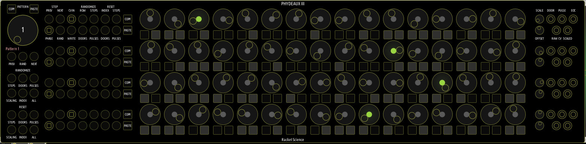
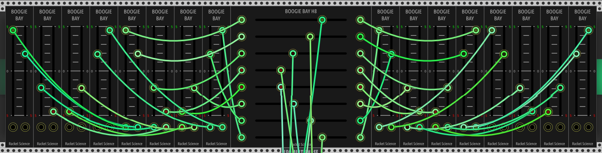
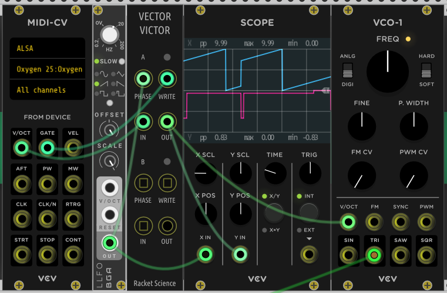

# Racket Science
Modules for the VCV Rack virtual modular synthesizer.

## PHYDEAUX III

I know, yet another bloody step sequencer.  I built this as an exercise and as a result feel much more confident developing for VCV now.  It's the size of a bus so I named it after one of Frank Zappa's.

You get sixteen patterns of four rows of sixteen steps with pulses and doors (gates that stay open across adjacent steps) for each step, each row also has an attenuverter and scaled CV output.  There are currently 276 parameters, 71 inputs, 148 outputs and 64 blinkenlights, in order to fit all of that into a meagre 104hp there are stealth sockets that only appear when you drag a cable, every pulse & door has it's own output and the buttons on the left also double up as inputs.  There are CV & write inputs, you can record a sequence from a midi keyboard should you wish.  Outputs can be fed back into inputs so, for instance, if you want a row to be eight steps long, set a pulse on the ninth step and feed that back to the index reset input for that row.  If you want to modify steps on the fly, you could take a door output into write in.  Similarly you can play back multiple pattern by feeding a EOC output back to the next pattern input.  You could use pulses from one row to step another row etc etc. The possibilties are endless really.

There is also a phase input so it can be driven by modules such as ZZC and run backwards if you like.

 

## Boogie Bay

You've seen flying faders, with Boogie Bay you have sliding sockets for all of your wire wobbling needs.
These modules also double up as voltage indicators, right click on the vertical 2 channel BB for range menu, BBH8 range can be selected for each channel by clicking on the individual voltage labels, also BBH8 has invisible scribble strips, click on an underscore to enter text to describe each channel.

## Vector Victor

Shortly after I first got into VCV around May 2019 I found myself looking for a real time CV loop recorder yet couldn't find one, once the VCV Prototype module appeared I created a simple precursor of Vector Victor, also inspired by the ZZC phase based way of timing.

Vector Victor is a phase driven CV recorder, if you're familiar with programming think of it as a thousand element array indexed by the phase input as that's exactly what it is.  You get two for the price of one!

Typically you would feed the phase input with a slow rising sawtooth from a LFO, or ZZC clock & divider modules to keep everything in sync.  A simple use case is shown below where Vector Victor loops input from a MIDI keyboard.  It can also be used to record knob movements or whatever really but is not designed with audio rates in mind.

As a typical use case for recording knob movements requires a MIDI mapped knobs module and buttons module feeding VV, the next version of VV (VV WKO) will have knobs & buttons which can be directly MIDI mapped so other modules aren't required.

Note that VV saves state, so if you record a loop with it and then duplicate or save the preset the state will persist.

## Notices

**Racket Science** is copyright © 2020 Ewen Bates, specifically:

All **source code** is copyright © 2020 Ewen Bates and is licensed under the [GNU General Public License v3.0](gpl-3.0.txt).

All **graphics** in the `res` directory are copyright © 2019 Ewen Bates and licensed under [CC BY-NC-ND 4.0](https://creativecommons.org/licenses/by-nc-nd/4.0/).

Many thanks to the VCV developer community.
